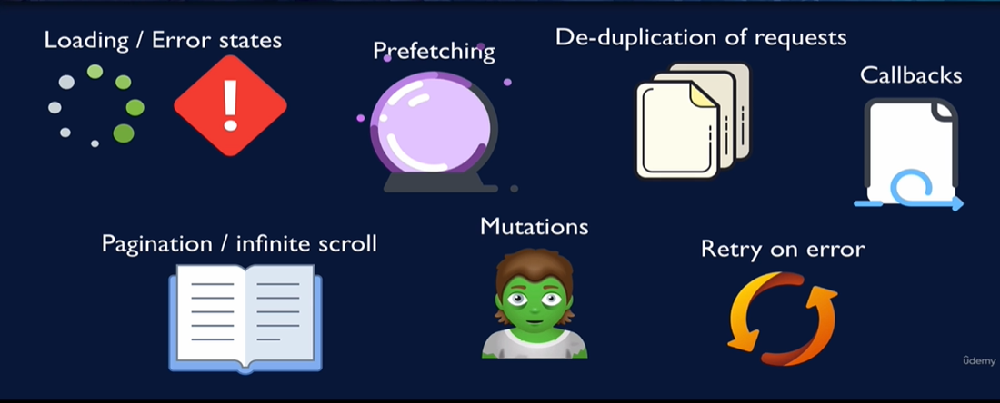

# React query / Tanstack Query: React Server State Management

- [1. Introduction to React Query](#client-state-vs-server-state)
- [2. React Query Setup](#react-query-setup)
- [3. Queries](#queries)
- [4. isFetching vs. isLoading](#isfetching-vs-isloading)
- [5. React Query Dev Tools](#react-query-dev-tools)
- [6. staleTime vs. gcTime]()

## Client State vs Server State
* Client state: information relevant to browser session;
* Server state: information stored on server but needed to display on the client.

## What problem does React Query solve?
* Maintains cache of server data on client; 
    * When you fetch server data, do it via React Query
* Manages data.
    * It is your job to indicate when yo update cache with new data from server. You can do it in 2 ways:
        * imperatively: invalidate data
        * declaratively: configure how (e.g. window focus) and when to trigger a re-fetch

## Plus:

## React Query Setup
* Create Query Cliet, which contains cache and tools
* Add Query Client Provider
    * Takes Query Client as prop

## Queries
A query is a declarative dependency on an asynchronous source of data that is tied to a unique key. A query can be used with any Promise based method (including GET and POST methods) to fetch data from a server. If your method modifies data on the server, it is recommended to use Mutations instead.

To subscribe to a query in your components or custom hooks, call the useQuery hook with at least:

* A unique key for the query
* A function that returns a promise that:
    * Resolves the data, or
    * Throws an error

The unique key you provide is used internally for refetching, caching, and sharing your queries throughout your application.

See the status of the query (isPending, isError, isSuccess... ) [here](https://tanstack.com/query/latest/docs/react/guides/queries).

## isFetching vs. isLoading
* isFetching
    * the async query function hasn't yet resolved.
* isLoading
    * no cached data, plus isFetching

## React Query Dev Tools
* Shows queries (by key)
    * status of queries
    * last updated timestamp
* Data explorer
* Query Explorer
* [Documentation](https://tanstack.com/query/v4/docs/react/devtools)

## staleTime vs. gcTime
* staleTime
    * Stale data: data that is "expired" and is ready to be refetched
    * Still in cache
        * "Stale while revalidating"
    * Data refetch only triggers for stale data
        * e.g. components remount, window refocus
        * staleTime translates to "max age"
            * How to tolerate data potentially being out of date?
        * Is for when data needs to be refetched
* gcTime (garbage collection time)
    * Is how long to keep data that might be re-used later
    * Query goes into "cold storage" if there's no active useQuery
    * Cache data expires after gcTime(default: 5min)
        * How long it's been since the last active useQuery
    * After the gcTime elapses, the data is garbage collected.
